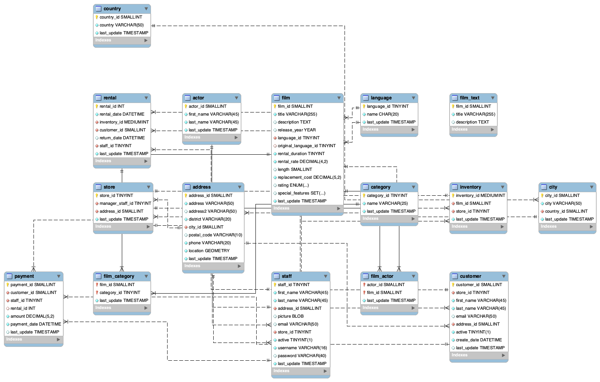

# Final Assessment – SQL Module 2(Adalab)

This repository presents the solutions developed during the live technical assessment of the SQL module, using the **Sakila** relational database. It features 24 business-driven SQL exercises that reflect real-world business scenarios and the technical depth expected in SQL-oriented roles.

---

## 💡 Description

This project demonstrates hands-on SQL capabilities that are highly valued by companies in the fields of data analytics, business intelligence, and information systems:

- **Subqueries**, including correlated subqueries
- **JOIN optimization** (`INNER JOIN`, `LEFT JOIN`)
- Use of **Common Table Expressions (CTEs)** for modular queries
- **REGEXP** for pattern extraction and string filtering
- Aggregation functions (`AVG`, `COUNT`, `SUM`) and advanced filtering

📝 The SQL scripts include in-line comments (using `#`) to explain the logic and decision-making behind each query. These annotations demonstrate technical thinking and business understanding.

✅ One of the solutions using CTEs was presented live during a **technical interview** as part of the final evaluation process.

---

## 🧭 Entity Relationship Diagram (Sakila)



---

## 📂 Repository Structure

```
📦 sql-final-assessment-adalab/
│
├── Queries-with-comments-en(translated).sql       # Translated queries (with inline comments)
├── Queries-with-comments-es(original).sql         # Original queries (in Spanish)
├── SQL-module2-instructions(english-spanish).md   # Instructions translated to English
├── Sakila-er-diagram.png                          # ER diagram (used as reference)
└── README.md                                      # Project overview (this file)
```

---

## 📌 Sample Queries

✨ This section shows selected SQL examples that reflect advanced query techniques often expected in interviews and real-world data tasks.

### 🔁 Correlated Subquery

Identify customers who spent more than the average across all customers:

```sql
SELECT cus.first_name, cus.last_name, SUM(p.amount) AS total_spent
FROM customer cus
JOIN payment p ON cus.customer_id = p.customer_id
GROUP BY cus.customer_id
HAVING total_spent > (
    SELECT AVG(customer_total)
    FROM (
        SELECT SUM(p2.amount) AS customer_total
        FROM payment p2
        GROUP BY p2.customer_id
    ) sub
);
```

### 🔎 REGEXP for Pattern Matching

Retrieve movies with descriptions containing the word "amazing":

```sql
SELECT title, description
FROM film 
WHERE description REGEXP 'amazing';
```

### 🧱 CTE to Exclude Actors from a Specific Category

Find actors who **have not acted** in any "Horror" movies:

```sql
WITH horror_actors AS (
    SELECT actor_id
    FROM actor
    JOIN film_actor USING (actor_id)
    JOIN film USING (film_id)
    JOIN film_category USING (film_id)
    JOIN category USING (category_id)
    WHERE category.name = 'Horror'
    GROUP BY actor_id
)
SELECT actor_id, first_name, last_name
FROM actor
WHERE actor_id NOT IN (SELECT actor_id FROM horror_actors);
```

✅ This query was presented live during the technical interview evaluation.

### 🤝 Optimized JOINs

Retrieve the number of movies rented per customer, including names:

```sql
SELECT cus.first_name, cus.last_name, COUNT(ren.inventory_id) AS total_rentals
FROM rental ren
INNER JOIN customer cus USING (customer_id)
GROUP BY cus.customer_id, cus.first_name, cus.last_name;
```

---

## ⚙️ Getting Started

1. Clone this repository:
   ```bash
   git clone https://github.com/Adalab/bda-modulo-2-evaluacion-final-ana-nobre.git
   ```

2. Read the instructions in `SQL-module2-instructions-en.md`.

3. Make sure you have MySQL and MySQL Workbench installed.

4. Download and import the **Sakila** database from the official source:  
   [https://dev.mysql.com/doc/index-other.html](https://dev.mysql.com/doc/index-other.html)

5. Open `Queries-with-comments-en.sql` in MySQL Workbench and execute the SQL queries block by block.

---

## 🧰 Requirements

- MySQL 8.0 or higher  
- MySQL Workbench  
- Sakila database installed locally

---

## 📚 Useful Resources

- [MySQL SQL Syntax Overview](https://dev.mysql.com/doc/refman/8.0/en/sql-statements.html)
- [MySQL REGEXP Reference](https://dev.mysql.com/doc/refman/8.0/en/regexp.html)
- [Common Table Expressions (CTE) – WITH Clause](https://dev.mysql.com/doc/refman/8.0/en/with.html)
- [JOIN Syntax and Optimization](https://dev.mysql.com/doc/refman/8.0/en/join.html)

---

## 👩‍💻 Author

Project developed by Ana Nobre as part of the Adalab curriculum focused on SQL and relational database modeling.
